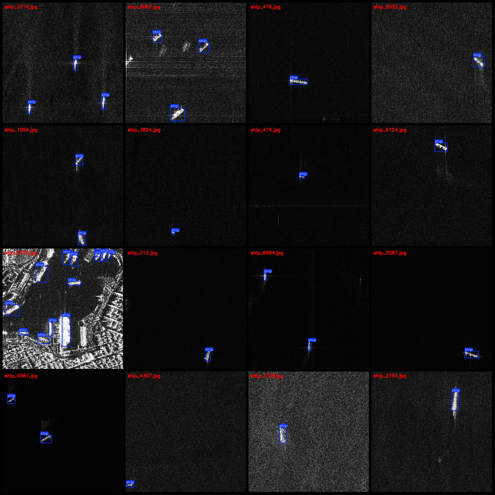
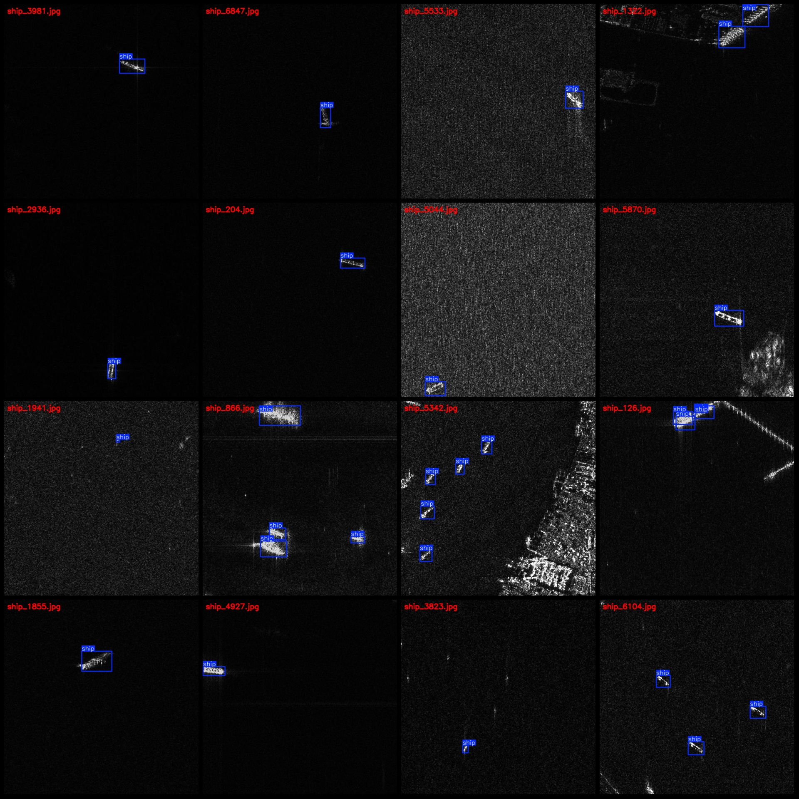

# RSDD-SAR Radar Ship Detection Dataset: VOC+YOLO (Pascal VOC format + YOLO format) - 6999 images in 1 category

Dataset format: Pascal VOC format + YOLO format (without split paths in a txt file, only including JPG images and corresponding VOC format xml files and YOLO format txt files)
Number of images (JPG file count): 6999
Number of labels (XML file count): 6999
Number of labels (TXT file count): 6999
Number of categories: 1
Label category name: ["ship"]
Number of bounding boxes per category:
ship bounding boxes = 10261
Total bounding boxes: 10261
Number of images per category:
ship images = 6999
Image resolution: 640x640
Annotation tool used: labelImg
Annotation rules: draw rectangular bounding boxes for each category
Important note: The dataset does not have been split into training, validation, or test sets; users are required to divide them themselves.
Special notice: This dataset does not guarantee the accuracy of models trained on it or any weights files.
Image preview:
Annotation examples:

## Images

Here is a pay link on Stripe ( https://buy.stripe.com/3cs8yP7sY87d0vu9AB ). Please contact me lonlonago@foxmail.com after funding $89, and I will send you a complete data files , thank you!

